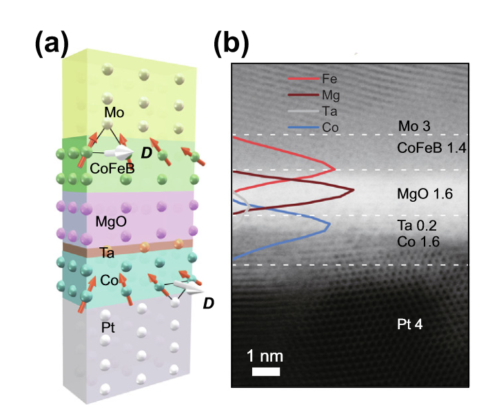
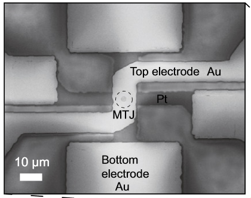
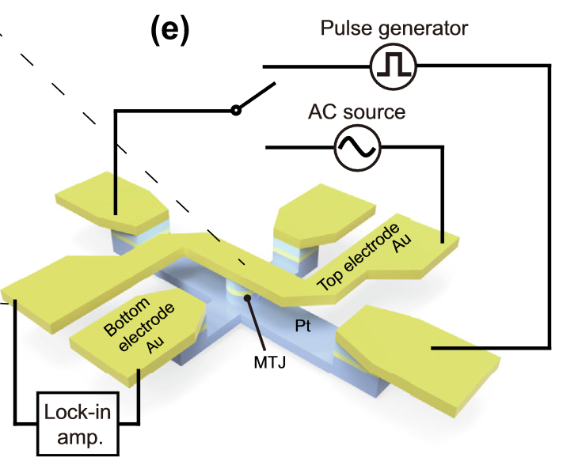
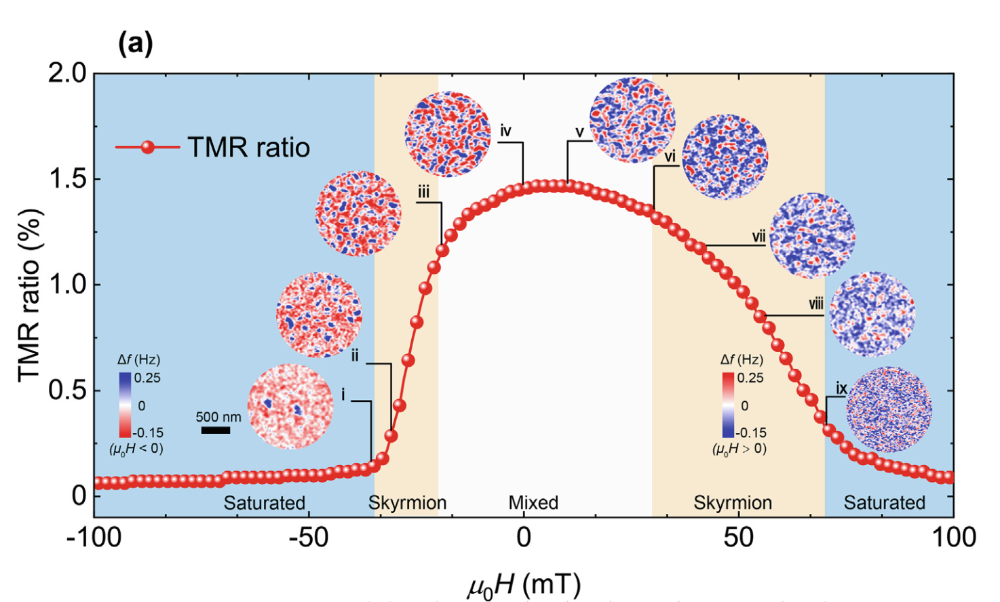
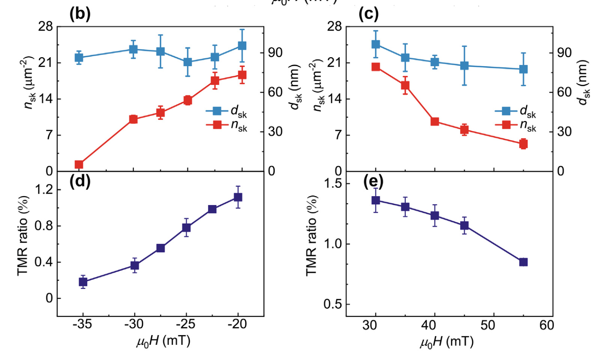
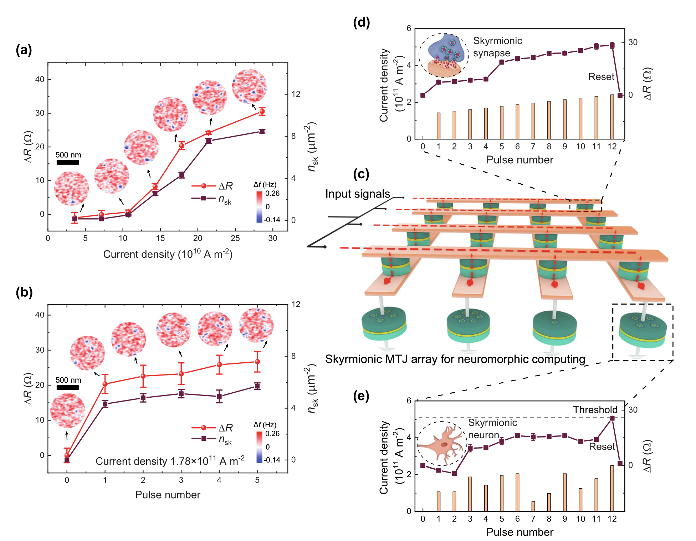

---
format:
  revealjs: 
    theme: dark.scss
    transition: slide
    chalkboard: true
date: "September 14, 2022"
---

# Experimental demonstration of skyrmionic magnetic tunnel junction at room temperature

::: footer
Dreycen Foiles, 9-14-2022
:::

## Motivation 

::: {.incremental}

- Skyrmions are a promising candidate for next generation information storage and processing technologies
- Reliable electrical detection of skyrmions is one of the major hurdles preventing development of skyrmionics 
- There are methods that make use of the anomalous Hall effect or noncollinear magnetoresistance but either produce very weak signals or would be difficult to integrate with modern electronics 
- Using magnetic tunnel junctions (MTJ's), this paper aims to develop an electrical detection method that exploits tunnel magnetoresistance (TMR) to create a larger output signal
:::

## Skyrmion TMR Modeling {.smaller}

$$ G = g_p S - \frac{\Delta g}{2} \int (1 - \cos\theta) ds $$

$$ G = g_p S - \pi n_{sk} d_{sk} \Delta g w S dx$$

:::: {.columns} 
::: {.column} 
- $g_p$ is the unit conductance
- $S$ is the area of the MTJ
- $\Delta g$ is the difference in conductance between parallel and anti-parallel state
- $w$ is the effective domain wall width
:::

::: {.column} 

- $\theta$ is the angle between the magnetization of the Co and CoFeB layers
- $n_{sk}$ is the density of skyrmions 
- $d_{sk}$ is the average diameter of a skyrmion
::: 

::::

## Device Growth

:::: {.columns} 
::: {.column width="60%"}

:::

::: {.column width="40%"}
- Multilayers were fabricated with sputtering 
- Layer compositions were confirmed using STEM
:::
::::

## Device Fabrication

:::: {.columns} 
::: {.column}
{ width=70\%}
{ width=70\%}
:::

::: {.column}
- The skyrmion stack was fabricated into a MTJ using photolithography and Ar ion milling
- A lock-in amplifier paired with an AC signal generator was used to measure the TMR ratio of the MTJ (AC signal was 133.33 Hz)
- Current pulses were used to nucleate skyrmions 
:::
::::

## Device Characterization {.smaller}

{fig-align="center" width=70%}

- The TMR ratio was measured for different external field values
- When the field was fully satured, the TMR ratio was zero
- The TMR ratio was maximixed in a mixed state between skyrmions and other stripe domains

## Device Characterization Continued {.smaller}

:::: {.columns}

::: {.column width=60%}

:::

::: {.column width=40%}

- The TMR ratio when the system is in the skyrmion-phase is plotted against the external field
- The relationship between the skyrmion density and average skyrmion diameter was plotted against the applied field
- There appears to be a more-or-less linear relationship betwee $n_{sk}$, $d_{sk}$ and the TMR ratio, which is in agreence with model
:::

::::

## Neuromorphic Computing
{fig-align="center"}

